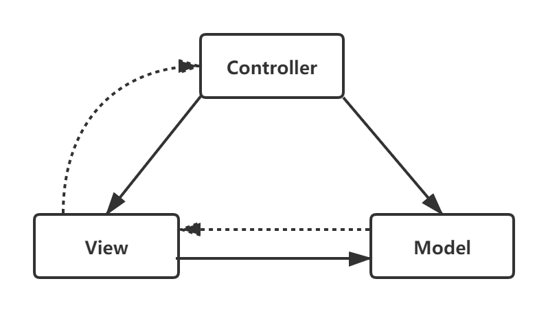
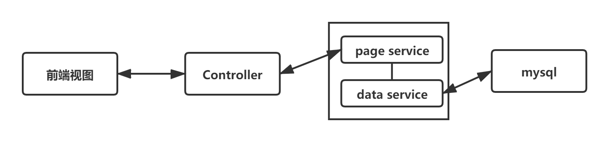

## go的api接口实现

现在要是用go完成一些业务逻辑的开发。web框架大部分是基于MVC的，我们这里使用了原生的net/http包，但是也要严格按照MVC架构来。

### MVC 模式
MVC模式是把程序分为以下三个部分：

* 控制器（Controller）：负责转发请求，对请求进行处理。
* 视图（View）：界面设计人员进行图形界面设计。
* 模型（Model）：程序员编写程序应有的功能（实现算法等等）、数据库专家进行数据管理和数据库设计（可以实现具体的功能）。

而现在流行的前后端分离项目，把View层抽到了前端来做，后端主要是M和C层。

其中model被拆分成了page service 和 data service 两层，data service 实际对接了mysql内单表的操作，而page service是对data service的组合以及相关的业务逻辑处理。

我们就按这个规则进行代码结构的设计。

### json数据处理
go标准库 提供了json的处理包， encoding/json 