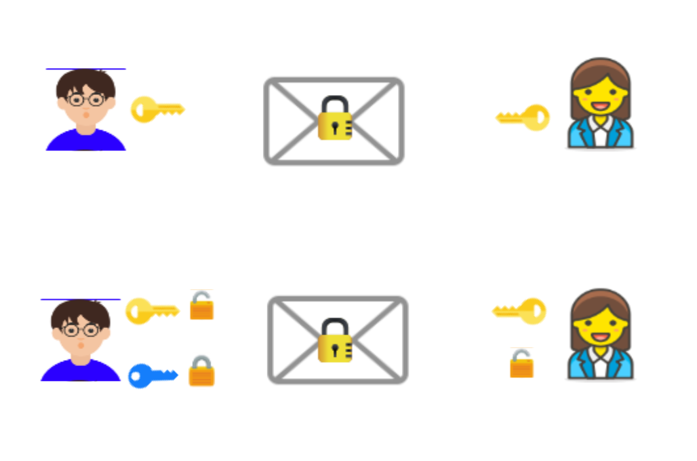

## 密码学
既然是支付系统的接口，那么安全性是首要考虑的因素。必然要用到密码学相关的知识。

加密方式有两种:

* 对称加密
* 非对称加密

对称加密是指加、解密使用相同的密钥。
非对称加密是指加、解密使用一对不同的密钥，这一对密钥包括公钥和私钥，公钥加密的信息只有私钥可以解，相反私钥加密的信息只有公钥可以解。

非对称加密算法不止用在加解密操作，还有一个更通用的功能--签名和验签。
因为公钥是公开的，所以任何人都可以拿着公钥去解密私钥加密的信息。如果用公钥可以解密信息的话，那么必定能够证明加密信息的人是持有私钥的人。

所以我们可以得出来，如果只有我们自己有私钥，而支付宝拿着我们的公钥，必定能够证明支付的请求是来源于我们，相反的，如果我们有支付宝的公钥，就可以证明支付宝的身份。
