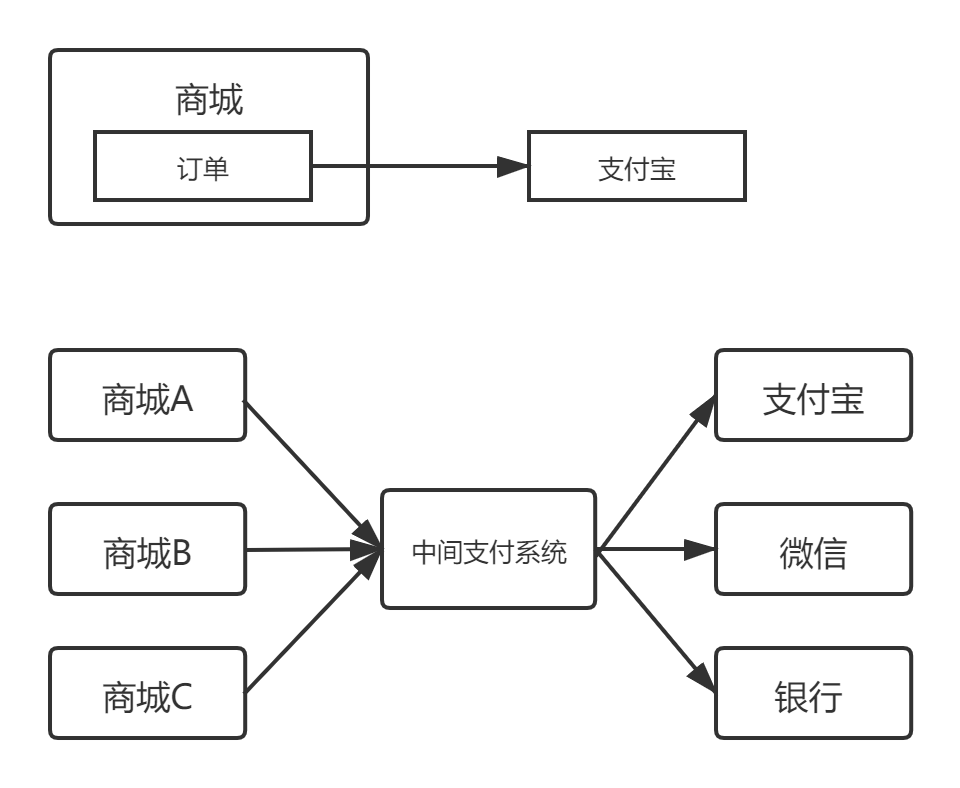

## 本章内容

* 使用go实现模拟商城

 

### 为什么需要模拟商城？

* 从了解go语法到项目实战开发的顺利过渡

在熟悉了go的语法之后，学习go项目的组织构建、标准库net/http的使用及原理。

* 为支付系统提供测试方法

我们本课程讲解是支付系统，而支付系统是为其他业务系统提供接口能力的，所以这里实现模拟商城的目的是为支付系统提供测试方法--提供支付系统发起支付请求的商城。 
而我们先从商城的支付功能实现，然后解耦出支付系统，也更直观的展示了复杂业务的解耦以及支付系统的发展。

### 支付功能和支付系统

在现在的网站上，一般都会有支付的功能，在线支付能力已经是现代化网站的必备功能模块。 

类似于电商网站，在下订单之后可以成功调用支付宝的接口进行订单的支付, 这就是一个典型的支付功能应用。

那么支付系统是什么呢？  

** 支付系统就是提供支付服务的系统，** 其本身应该和业务系统（这里是图中的商城）解耦。就像第二个图中所示，支付可以作为系统对不同的业务提供服务。
所以在图一中，支付宝也是一个支付系统。

