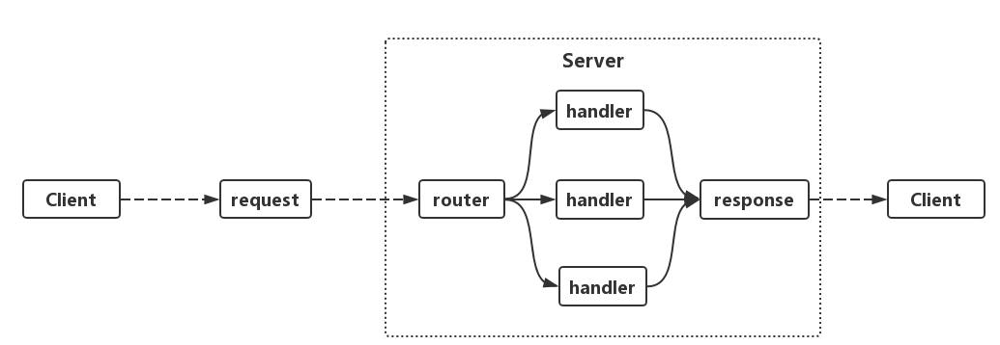

## 实现http服务
go的标准库[net/http](https://godoc.org/net/http)同时提供了http客户端和服务端的实现，基于[net/http](https://godoc.org/net/http)可以实现web服务的快速搭建。

#### 创建服务

```
func main() {
    http.HandleFunc("/hello", sayHello)
    http.ListenAndServe(":8080", nil)
}

func sayHello(w http.ResponseWriter, r *http.Request) {
    w.Write([]byte("hello world"))}
```

#### 实现原理
使用net/http包只需要两行代码就可以实现一个web服务。但是go在底层是如何实现的呢？
一般来说，http的服务端处理流程都是如下图表示：



客户端Client发出请求request,服务端Serve接收到请求后先进入路由router，然后为对应的请求(request找到对应的处理器handler处理,处理器handler对请求的处理结果就是构建了返回值response。
<br/>
其实go的http服务也是一样的流程。<br/>
再回头看上面实现的server代码，首先调用了 **Http.HandleFunc**
这个函数的功能就是注册路由。
在源码中HandleFunc最终是将我们实现的sayHello函数转成了一个handler对象，并注册进了servermux里面。

##### handler
handler 是一个实现ServeHTTP方法的接口类型。只要类型具备ServeHTTP函数那么它就实现了Handler接口。

```
type Handler interface {
    ServeHTTP(ResponseWriter, *Request)
}
```

再来看 HandlerFunc 是如何把 sayHello函数 「封装」成一个Handler对象的呢?

```
func (mux *ServeMux) HandleFunc(pattern string, handler func(ResponseWriter, *Request)) {
	if handler == nil {
		panic("http: nil handler")
	}
	mux.Handle(pattern, HandlerFunc(handler))
}
```

主要是调用了HandlerFunc(handler) 把sayHello变成了Handler。

```
type HandlerFunc func(ResponseWriter, *Request)

// ServeHTTP calls f(w, r).
func (f HandlerFunc) ServeHTTP(w ResponseWriter, r *Request) {
	f(w, r)
}
```

具体看HandlerFunc竟然神奇的发现它是一个实现了ServeHTTP的函数类型，HandlerFunc(handler)这一步仅仅是完成了一个函数类型到函数类型的转换。sayHello这个方法就等于是Handler的ServeHTTP方法。
从这里看go语言的类型和类型转换是不是很有意思？

##### servermux
注册handler的代码里出现了DefaultServeMux, 这是一个ServeMux的对象。

```
type ServeMux struct {
	mu    sync.RWMutex
	m     map[string]muxEntry
	es    []muxEntry // slice of entries sorted from longest to shortest.
	hosts bool       // whether any patterns contain hostnames
}
```

m这个字段是最重要的结构，存放了整个服务的具体路由信息，通过这个map可以让每一个路径都找到对应的handler。
看一下mux的Handle方法就知道,  map的key值就是路径，value是路径和handler一起组成的一个结构体

```
func (mux *ServeMux) Handle(pattern string, handler Handler) {
   ...
    e := muxEntry{h: handler, pattern: pattern}
    mux.m[pattern] = e
   ...
}
```

上面就是路由的结构以及路由注册的过程。下面看下servermux是路由是如何工作的。<br/>
在同一个文件下，可以发现ServeMux对象的Handler方法，这个Handler方法的功能就是根据请求里面的url 从路由结构map里取得对应的处理handler实体。

```
func (mux *ServeMux) Handler(r *Request) (h Handler, pattern string) {
    ...
    
    return mux.handler(host, r.URL.Path)
    ...
}
func (mux *ServeMux) handler(host, path string) (h Handler, pattern string) {
    ...
    h, pattern = mux.match(path)
    ...
}

func (mux *ServeMux) match(path string) (h Handler, pattern string) {
    // Check for exact match first.
    v, ok := mux.m[path]
    if ok {
        return v.h, v.pattern
    }
    // Check for longest valid match.  mux.es contains all patterns
    // that end in / sorted from longest to shortest.
    for _, e := range mux.es {
        if strings.HasPrefix(path, e.pattern) {
            return e.h, e.pattern
        }
    }
    return nil, ""
}
```

##### 请求处理流程
上面是路由如何注册和查找的，启动服务还是靠的下面这个语句。

```
http.ListenAndServe(":8080", nil)
```

进入代码可以总结成如下的过程:
1. 监听端口，循环监听socket

```
ln, err := net.Listen("tcp", addr)
...
for {
    ...
}
```

2.接收到请求后，创建网络连接并启动一个goroutine处理

```
rw, e := l.Accept()

go c.serve(connCtx)

```

3.从该链接读取请求参数构造出http.Request对象, 并交给ServeMux处理

```
serverHandler{c.server}.ServeHTTP(w, w.req)
```

4.ServeMux 就是调用Handler找到请求url的handler实例，并调用handler的处理方法ServeHttp进行处理。

```
func (mux *ServeMux) ServeHTTP(w ResponseWriter, r *Request) {
    if r.RequestURI == "*" {
        if r.ProtoAtLeast(1, 1) {
            w.Header().Set("Connection", "close")
        }
        w.WriteHeader(StatusBadRequest)
        return
    }
    h, _ := mux.Handler(r)
    h.ServeHTTP(w, r)
}
```

5.处理完成后返回结果(response)，并关闭请求连接